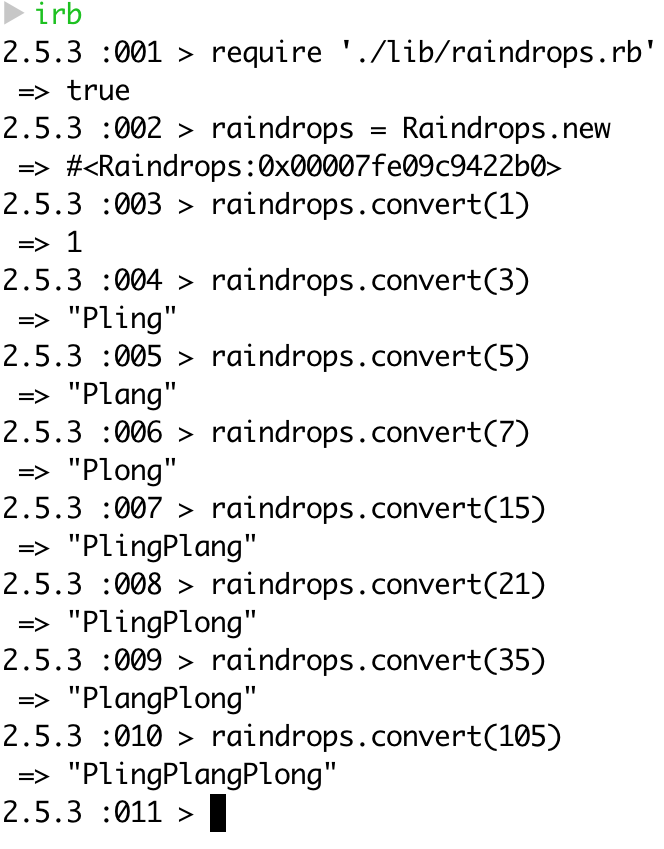

# Raindrops

The purpose of this tech test is to demonstrate a TDD process in any language and to show logical thinking during the exercise. I have used Ruby to do this, with rspec as my testing framework, accompanied with rubocop for my linter. Please check the commit history for a step by step breakdown of my process.

### **IMPORTANT**

Please note that the application does not print to the console, instead it is returned to the console. This was noted because the requirements didn't specify that they wanted the string to be printed out, simply returned.

## Instructions

Write a function that takes as its input a number (n) and converts it to a string, the contents of which depend on the numbers factors

- if the number has a factor of 3, output 'Pling'
- if the number has a factor of 5, output 'Plang'
- if the number has a factor of 7, output 'Plong'
- if the number does not have any of the above as a factor simply return the numbers digits

### Examples

- 28's factors are 1, 2, 4, 7, 14 and 28: this would be a simple 'Plong'
- 30's factors are 1, 2, 3, 5, 6, 10, 15, 30: this would be a 'PlingPlang'
- 34 has four factors: 1, 2, 17, and 34: this would be '34'

#  The application

## Running the tests & linter

Once the repo is forked or cloned, cd into it and run the ```rspec``` command from the command line

To run the linter, please run ```rubocop``` from the command line

## Running the application

Once you have cloned or forked the repository you will need to require the file in irb.

Then proceed to cd into the raindrops project.

To require the file type irb into the command line and run the following:
```
require './lib/raindrops.rb'
```

Carry out the following in the command line after requiring is successful
```
raindrops = Raindrops.new

raindrops.convert(1)
raindrops.convert(3)
raindrops.convert(5)
raindrops.convert(7)
raindrops.convert(11)

raindrops.convert('x')
```

In the example above, you can run any number you can think of and replace the ```x``` with a number

## Screenshots of the application in use


